# 🛡️ TimeShield: The Ultimate Productivity Command Center

**TimeShield** is a simple but powerful tool for Chrome, Brave, and other browsers. It helps you stay focused by blocking distracting sites, tracking your screen time, and giving you a floating clock that stays on top of your work.

---

## 🚀 How to Install

Since this is a custom productivity tool, you install it as a "developer" extension. It's very easy:

### 1. Download the extension
*   Go to the [**Releases**](https://github.com/abishekgh-6/TimeShield/releases) section of this repository.
*   Download the latest zip file (e.g., `TimeShield-v1.0.1.zip`).
*   Extract the zip file into a folder on your computer.

### 2. Add it to your browser
*   Open your browser and go to the **Extensions** page:
    *   **Chrome:** `chrome://extensions/`
    *   **Brave:** `brave://extensions/`
*   Turn on **Developer Mode** (usually a toggle in the top-right corner).
*   Click the **Load unpacked** button.
*   Select the folder where you extracted the extension.

### 3. Start Focused
*   Click the **Puzzle piece** icon in your toolbar and **Pin** TimeShield.
*   Click the Shield icon to open the menu and start your first focus session!

---

## ✨ Features

### 🕐 Floating Clock System
*   **Always-on-top Clock:** A draggable clock widget that stays on top of all websites
*   **3D Flip Clock:** Beautiful retro flip clock with smooth animations in fullscreen mode
*   **Fully Customizable:** Resize from small pill to large box, minimize to title bar
*   **Smart Positioning:** Remembers your preferred position and size across sessions
*   **Multiple Views:** Standard digital clock and immersive flip clock modes
*   **Theme Integration:** Matches your selected theme (Dark, Light, Solar Ember)

### 🛑 Advanced Blocking System (REFINED!)
*   **Accordion Organization:** All settings now use a beautiful, collapsible accordion interface with status badges.
*   **Custom Challenge Text:** Use your own motivational sentences instead of defaults for typing challenges.
*   **Challenge-based Unblocking:** Type motivational quotes to disable blocks (prevents easy bypass).
*   **Grace Pauses:** 2 free 5-minute pauses daily, then challenges required.
*   **Flexible Pause Options:** 5 minutes, 1 hour, or rest of day.
*   **Universal Pause Access:** Pause protection button available on all blocking screens.
*   **Verification System:** Multi-step verification with password and typing challenges.
*   **Visual Indicators:** Badge shows current blocking status (🎯 focus, 🚫 scheduled, 😴 sleep).
*   **Priority System:** Sleep blocking overrides all other blocking types.
*   **Dev-Friendly Sleep:** Intelligently ignores `localhost`, `127.0.0.1`, and local `.pdf` files.

### 🎯 Focus Mode
*   **Deep Work Sessions:** Block all distracting sites during focus periods
*   **Smart Redirects:** Blocked sites redirect to motivational focus screens
*   **Live Countdown:** Real-time timer display on block screens
*   **Session Management:** Start, pause, and extend focus sessions
*   **Motivational Content:** Rotating quotes and productivity tips

### 😴 Sleep Time Blocking (NEW!)
*   **Complete Site Blocking:** Blocks ALL websites during sleep hours
*   **Flexible Scheduling:** Set custom bedtime and wake time
*   **Day Selection:** Choose which days sleep blocking applies to
*   **Overnight Support:** Handles time ranges that span midnight (e.g., 10 PM - 6 AM)
*   **Sleep-themed Interface:** Calming block page with sleep-related motivational quotes
*   **Automatic Enforcement:** Checks every minute and activates/deactivates seamlessly

### ⏰ Scheduled Blocking
*   **Time-based Rules:** Automatically block sites during work hours
*   **Day-specific Settings:** Different schedules for weekdays vs weekends
*   **Site-specific Lists:** Choose which sites to block during scheduled times
*   **Smart Time Handling:** Handles normal and overnight time ranges

### ⏱️ Daily Time Limits
*   **Per-site Limits:** Set daily time caps for specific websites
*   **Real-time Tracking:** Shows remaining time on limit screens
*   **Challenge Protection:** Increasing limits requires motivational typing challenge
*   **Visual Warnings:** Countdown displays when approaching time limits
*   **Automatic Blocking:** Sites redirect when daily limit is reached

### 🌍 Global Shared Limits
*   **Combined Time Tracking:** Single time limit across multiple distracting sites
*   **Smart Grouping:** YouTube, Instagram, TikTok, etc. share one time budget
*   **Flexible Configuration:** Choose which sites count toward global limit
*   **Unified Blocking:** All sites in group blocked when limit is reached

### 🩹 Advanced Ad Blocker
*   **Smart Filtering:** Blocks ads and trackers while preserving functionality
*   **Content-safe:** Won't hide important content like social media posts
*   **Element Picker:** Right-click to hide any annoying page element
*   **Custom Filters:** Add your own filter rules
*   **Performance Stats:** Track ads blocked and bandwidth saved
*   **Whitelist Support:** Allow ads on trusted sites

### 📊 Screen Time Analytics (UPGRADED!)
*   **Historical Navigation:** Navigate back through past days and weeks using a new interactive date-picker.
*   **Flexible Ranges:** Daily, Weekly, and Monthly views with historical shifting.
*   **Detailed Tracking:** Monitor time spent on each website with 24-hour timelines.
*   **Visual Graphs:** Donut charts and bar charts for intuitive usage insights.
*   **Site Favicons:** High-quality icons for quick identification of visited domains.
*   **Quick Access:** Jump to stats directly from block screens.

### ⚡ Quick Actions & Controls
*   **One-click Blocking:** Add current site to blocklist from popup
*   **Ad Blocker Toggle:** Quick enable/disable from main menu
*   **Focus Mode Start:** Instantly begin focus sessions
*   **Clock Controls:** Show/hide, resize, and switch clock modes
*   **Settings Access:** Quick links to all configuration options

### ✅ Task Management
*   **Todo List:** Built-in task manager for productivity goals
*   **Daily Tasks:** Create and track daily objectives
*   **Focus Integration:** Tasks visible during focus sessions
*   **Progress Tracking:** Mark tasks complete and monitor progress

### 🎨 Themes & Customization
*   **Multiple Themes:** Dark Mode, Light Mode, Solar Ember
*   **Responsive Design:** Optimized for all screen sizes
*   **Animation Speed:** Control transition and animation timing
*   **Clock Customization:** Choose time format (12h/24h) and size
*   **Personalization:** Extensive customization options for all features

### 🔒 Privacy & Security
*   **100% Local Storage:** All data stays on your device
*   **No Tracking:** No analytics or data collection
*   **Secure Blocking:** Challenge system prevents easy bypass
*   **Encrypted Settings:** Local storage encryption for sensitive data

### 📱 Cross-platform Support
*   **Chrome Extension:** Full support for Chrome and Chromium browsers
*   **Brave Compatible:** Optimized for Brave browser
*   **Edge Support:** Works with Microsoft Edge
*   **Manifest V3:** Latest extension standards for security and performance

---

## 🎨 Themes
TimeShield includes Dark, Light, and Solar Ember themes. We've optimized the colors so everything is easy to read no matter which mode you use.

---

## 🖼️ Screenshots
Below are reference screenshots for the main views in TimeShield.

### Options Dashboard

<strong>General Settings</strong> – View image

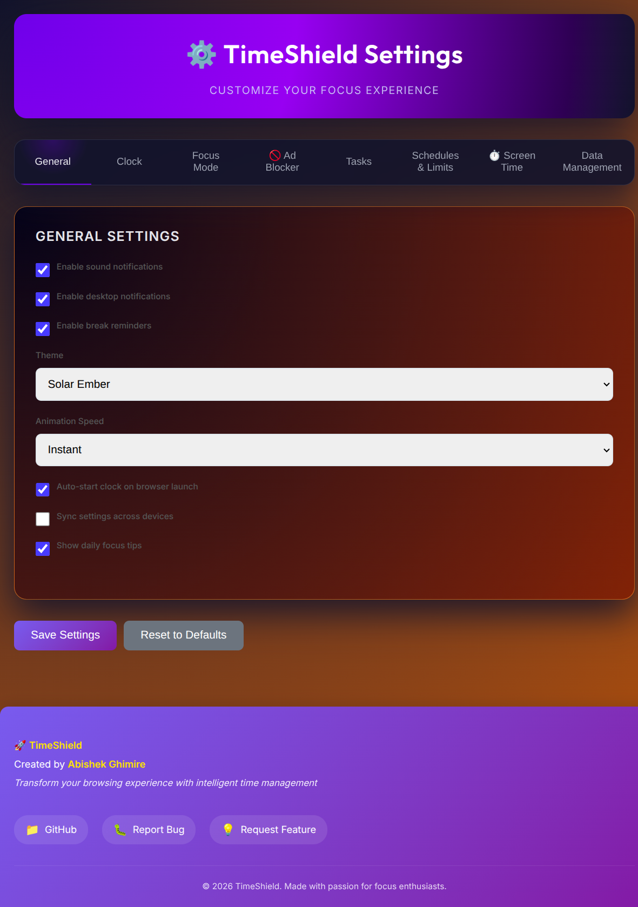

<strong>Clock Settings</strong> – View image

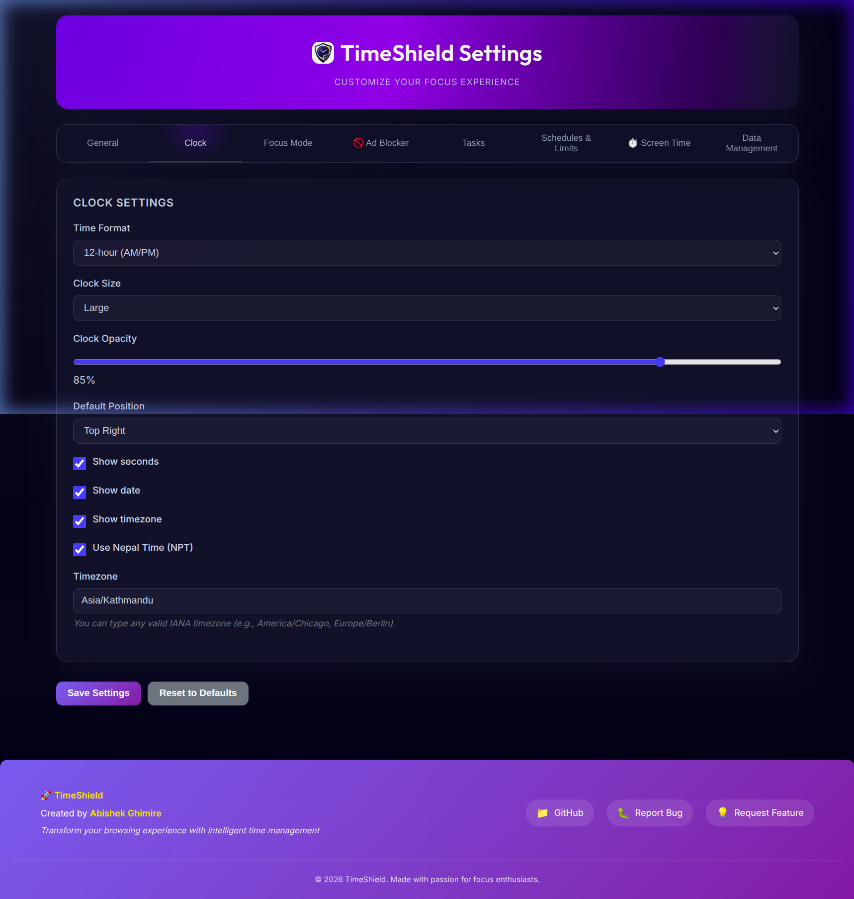

<strong>Focus Mode Settings</strong> – View image

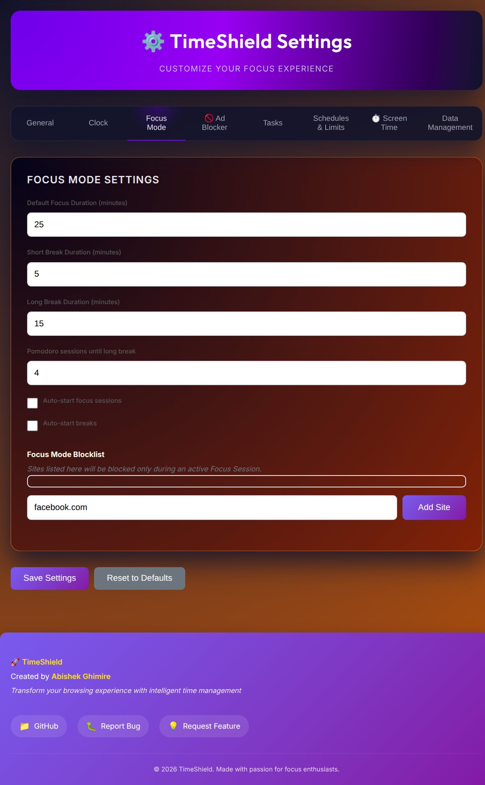

<strong>Schedules & Time Limits</strong> – View image

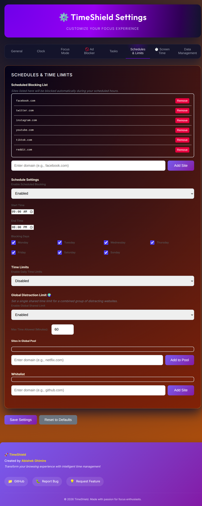

<strong>Ad Blocker Settings</strong> – View image

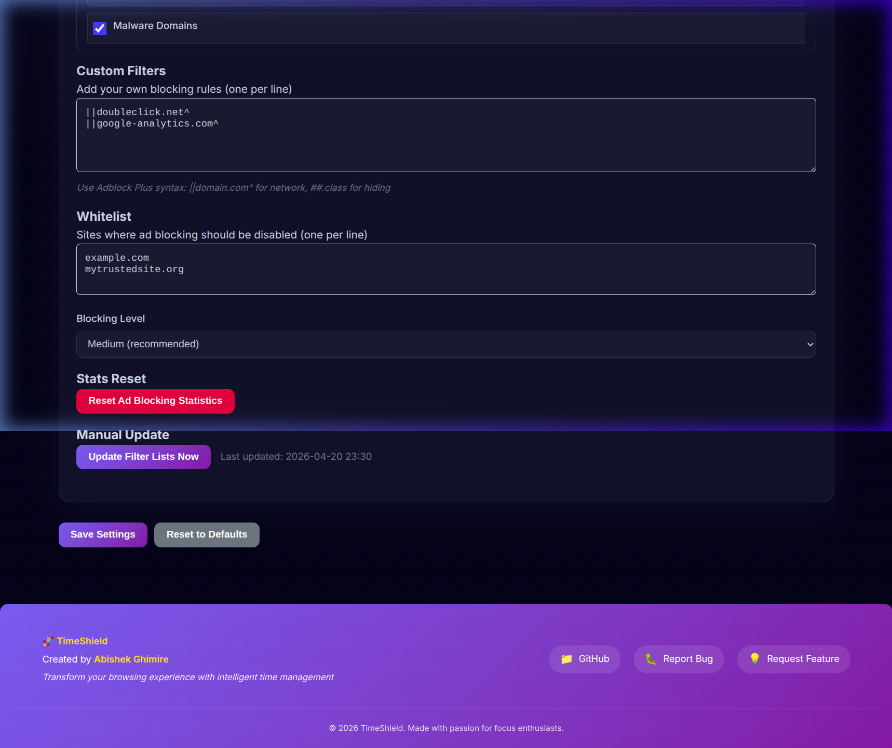

<strong>Screen Time Overview</strong> – View image

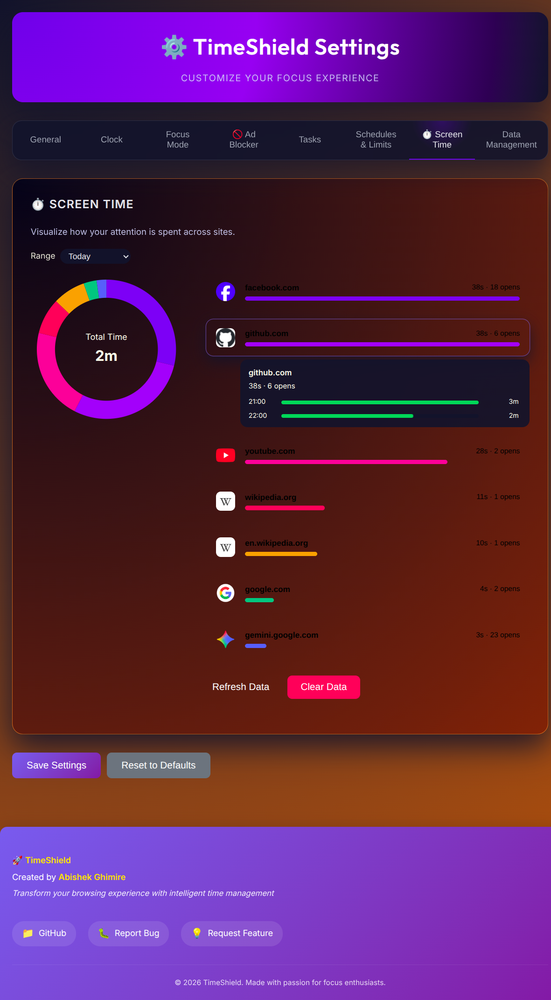

<strong>Tasks</strong> – View image

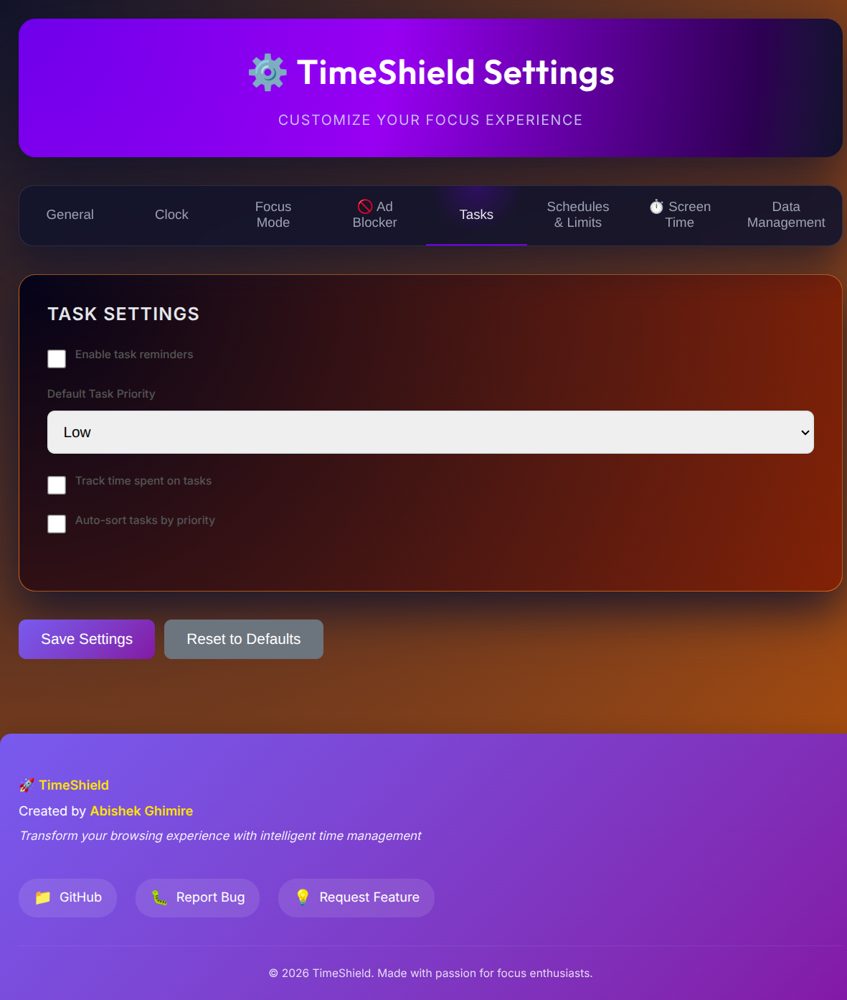

<strong>Data Management</strong> – View image

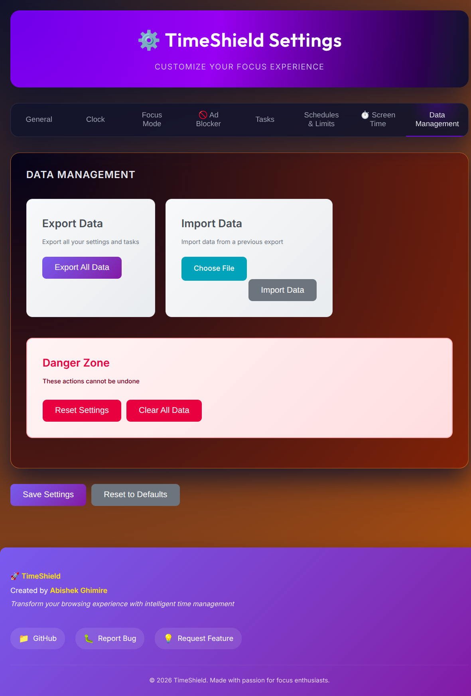

---

### Popup & Floating Clock

<strong>Control Center Popup</strong> – View image

<strong>Floating Clock Overlay</strong> – View image

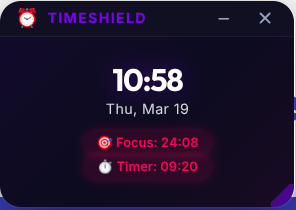

<strong>3D Flip Clock (New!)</strong> – View image

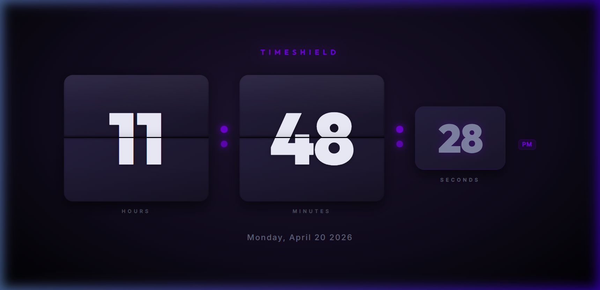

---

### Focus & Limits Screens

<strong>Focus Block Screen</strong> – View image

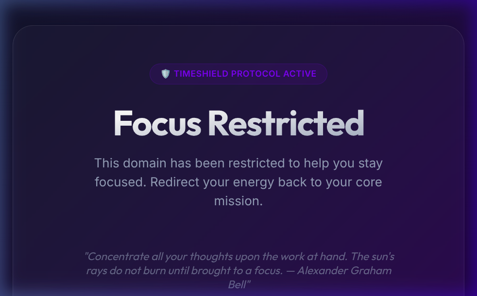

<strong>Time Limit Screen</strong> – View image

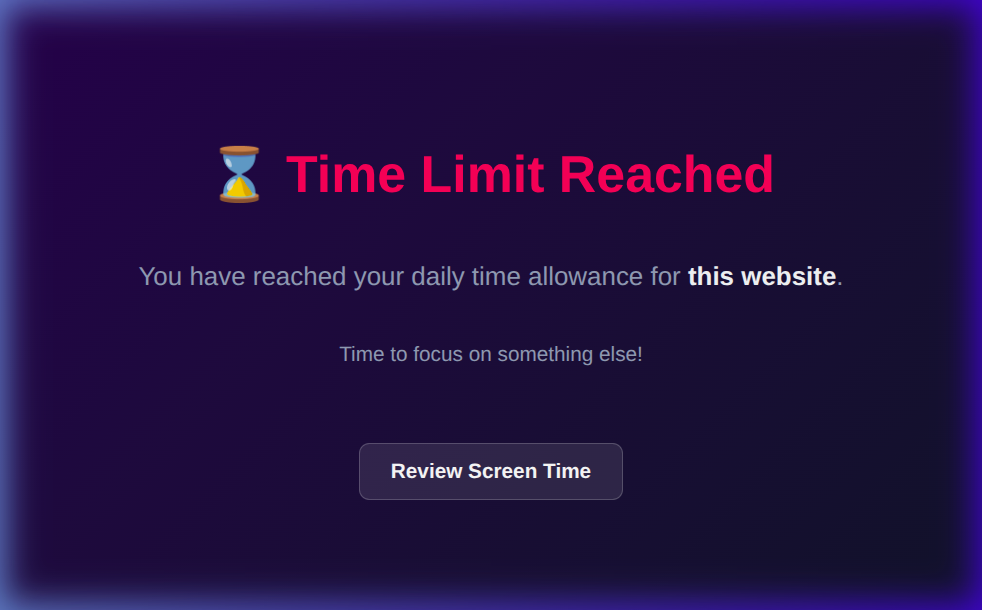

<strong>Sleep Blocking Screen (NEW!)</strong> – View image

---

## 📈 Privacy
**Everything stays on your computer.** TimeShield does not track you, and your browsing data never leaves your machine. Your stats and settings are stored locally in your browser.

---

## 📄 License
This project is under the **Apache License 2.0**. Feel free to use it and make it your own!

---

**Built to help you get more done, one focus session at a time.**

