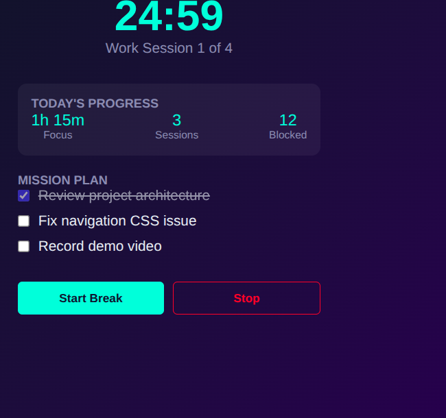
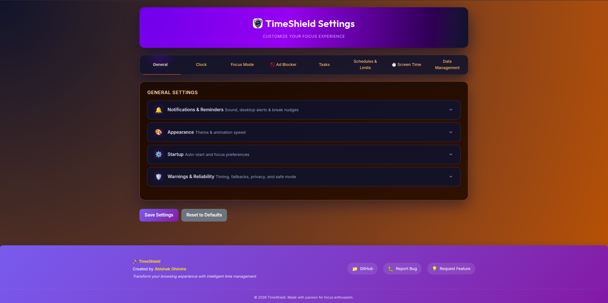
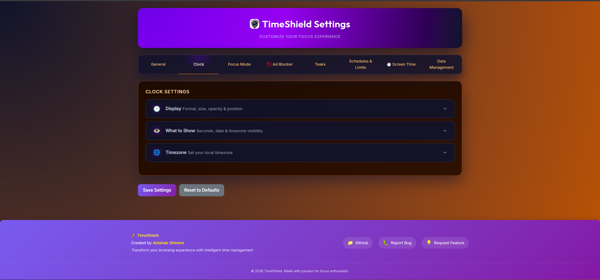
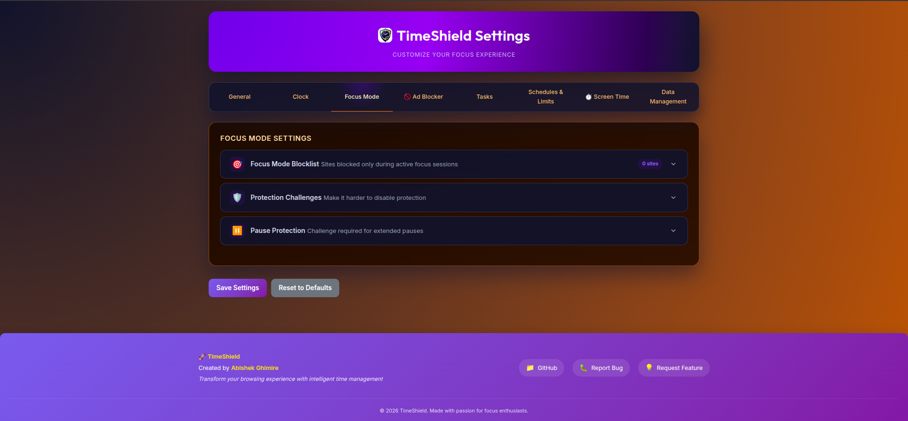
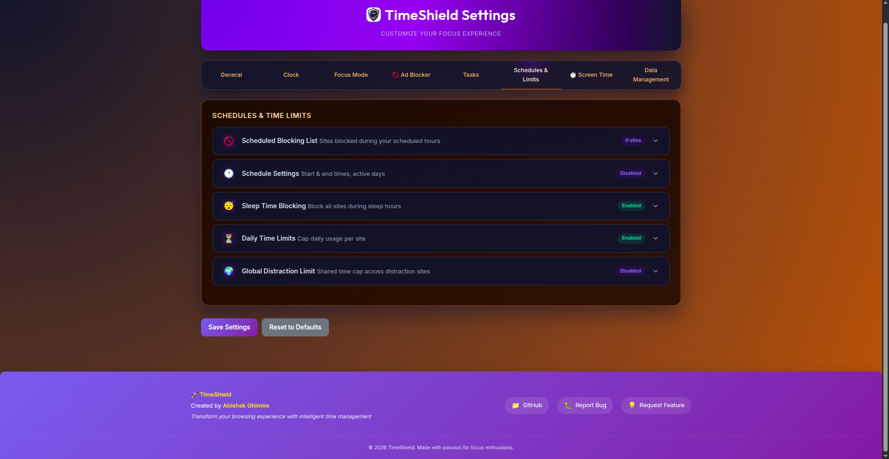
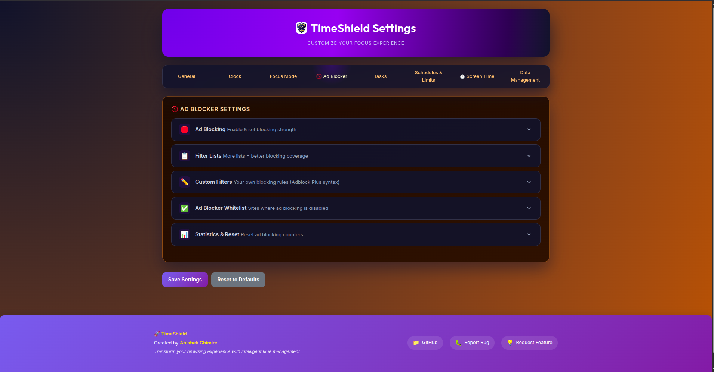
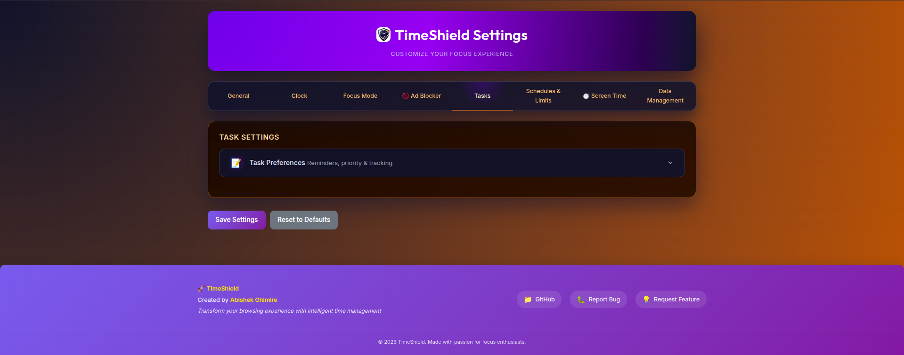
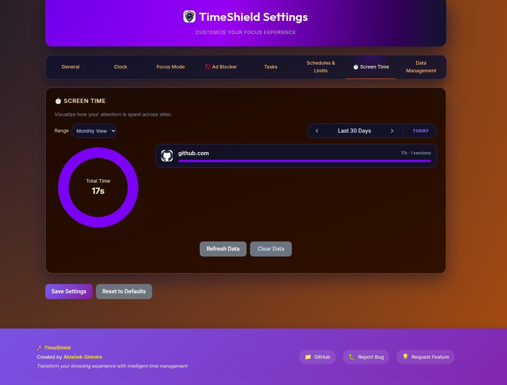
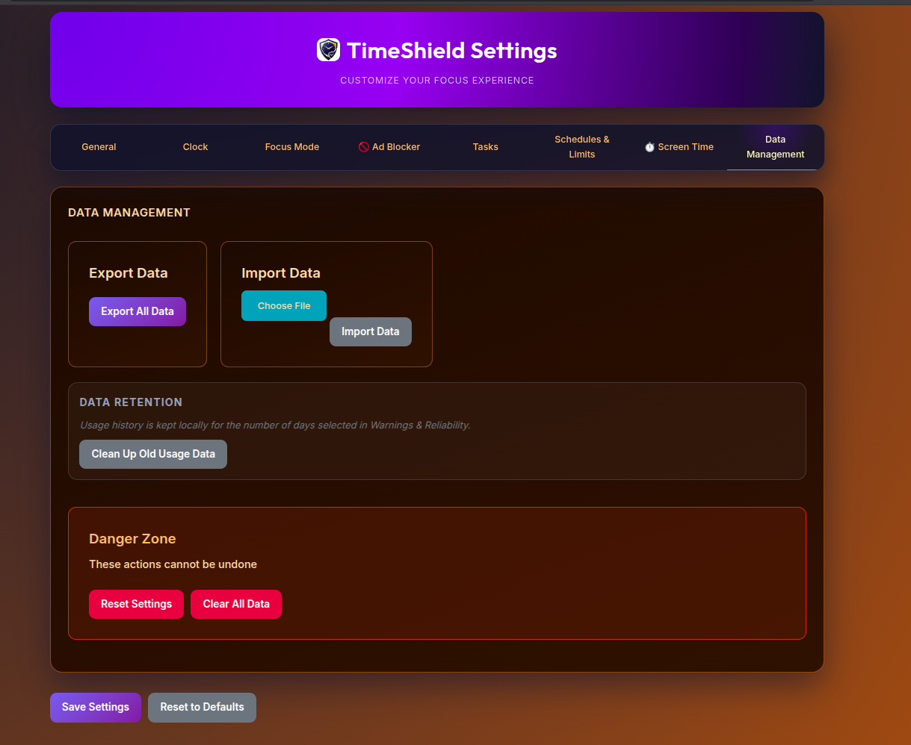

# TimeShield

[](https://github.com/abishekgh-6/TimeShield/releases)
[](https://developer.chrome.com/docs/extensions/develop/migrate/what-is-mv3)
[](LICENSE)
[](tests/smoke.test.mjs)
[](https://github.com/abishekgh-6/TimeShield/blob/main/data/repository-traffic.json)

**A local-first productivity and focus extension for Chromium-based browsers.**

TimeShield brings a floating clock, focus sessions, website blocking, scheduled protection, sleep protection, usage limits, screen-time tracking, tasks, and optional ad protection into a single lightweight browser extension.

**No account. No cloud sync. No required internet connection for core features. Your data stays in your browser.**

[Visit the TimeShield repository](https://github.com/abishekgh-6/TimeShield) · [Download the latest release](https://github.com/abishekgh-6/TimeShield/releases/download/v2.3.3/TimeShield-v2.3.3.zip)




---

## Why TimeShield?

Modern browsers make it easy to lose focus.

TimeShield is designed to give us control over distracting websites without turning the browser into an overly complicated productivity system.

We can decide:

* Which websites should be restricted
* When restrictions should be active
* How long we can use a website
* When we want to start a focus session
* How much screen time we are spending
* Whether we want a floating clock
* Whether we want optional ad protection

**Nothing is blocked automatically.**

TimeShield only acts on the websites and protection modes that we configure.

---

## Features

| Feature | What it does |
| --- | --- |
| 🕐 Floating Clock | Displays a draggable, resizable clock over supported webpages |
| ⏱️ Timers | Run timers directly from the extension |
| 🎯 Focus Mode | Restricts selected websites during focused work sessions |
| 📅 Scheduled Blocking | Blocks configured websites during selected days and times |
| 🌙 Sleep Protection | Applies a separate protection list, including schedules crossing midnight |
| ⏳ Usage Limits | Set daily limits for individual websites |
| 📊 Screen Time | Track active browsing time by website |
| 📝 Tasks | Maintain a small local task list |
| 🛡️ Ad Protection | Optional local rule-based ad protection |
| 🎨 Themes | Choose between Light, Dark, and Solar Ember themes |
| ⚙️ Customization | Configure clocks, animations, blocking behavior, and other settings |
| 💾 Local Storage | Store settings and activity data locally in the browser |
| 🔒 No Account Required | Core functionality does not require registration or cloud accounts |

---

## Screenshots

<details>
<summary>View the TimeShield screenshots</summary>

### Control Center


### General Settings



### Clock



### Focus Mode



### Scheduled Blocking



### Ad Protection



### Tasks



### Screen Time



### Data Management



</details>

---

# Installation

TimeShield is distributed as an unpacked Chromium extension and as a downloadable ZIP through GitHub Releases. The current package is [TimeShield-v2.3.3.zip](https://github.com/abishekgh-6/TimeShield/releases/download/v2.3.3/TimeShield-v2.3.3.zip).

There are two ways to install it.

## Option 1 — Download a Release

The current package can be downloaded directly here: [Download TimeShield-v2.3.3.zip](https://github.com/abishekgh-6/TimeShield/releases/download/v2.3.3/TimeShield-v2.3.3.zip).

1. Open the [TimeShield v2.3.3 release page](https://github.com/abishekgh-6/TimeShield/releases/tag/v2.3.3).
2. Download **[TimeShield-v2.3.3.zip](https://github.com/abishekgh-6/TimeShield/releases/download/v2.3.3/TimeShield-v2.3.3.zip)**.
3. Extract the ZIP to a permanent folder.
4. Open your browser's extension page:

   * Chrome → `chrome://extensions`
   * Brave → `brave://extensions`
   * Edge → `edge://extensions`
   * Other Chromium browsers → open their Extensions page

5. Enable **Developer mode**.
6. Click **Load unpacked**.
7. Select the extracted TimeShield folder containing `manifest.json`.
8. Pin TimeShield to the browser toolbar if desired.

> **Important:** Select the extracted folder, not the ZIP file itself.

---

## Option 2 — Clone the Repository

For development or inspection:

```bash
git clone https://github.com/abishekgh-6/TimeShield.git
cd TimeShield
```

Then:

1. Open the browser's Extensions page.
2. Enable **Developer mode**.
3. Select **Load unpacked**.
4. Choose the cloned `TimeShield` directory.

### Build step

TimeShield currently does **not require a build step**.

The repository can be loaded directly as an unpacked extension.

---

# Core Features

## Floating Clock

TimeShield can display a floating clock directly on supported webpages.

The floating clock can:

* Be moved around the page
* Be resized
* Remember its position and size
* Synchronize its state across open tabs
* Use 12-hour or 24-hour time
* Be displayed independently from the main Clock View
* Remain visible when supported pages enter fullscreen mode

A separate Flip Clock view is also available.

---

## Focus Mode

Focus Mode allows us to restrict websites during a focused work session.

We choose the websites that should be restricted and start the session when we are ready.

The current website can also be added to the Focus list directly from the popup.

When a restricted website is opened, TimeShield displays its focus/block interface instead of allowing normal browsing.

Pause requests are deliberate. The first two eligible one-minute general pauses each day can begin without a challenge; later attempts use the normal verification flow.

---

## Scheduled Blocking

Scheduled Blocking lets us configure website restrictions for specific:

* Days
* Start times
* End times
* Websites

The feature remains inactive until it is explicitly enabled and configured.

This makes it possible to create different protection periods without permanently blocking a website.

---

## Sleep Protection

Sleep Protection provides a separate protection system for websites that we want restricted during sleep hours.

It supports schedules that cross midnight.

For example, a schedule can begin during one calendar day and continue into the next.

The Sleep Protection list is separate from the normal scheduled-blocking list.

---

## Usage Limits

Usage Limits allow us to set a daily limit for individual domains.

TimeShield can warn us as a limit approaches and displays the remaining configured time in the control center.

When a limit is reached, the website can be paused for:

* 1 minute
* 5 minutes
* 10 minutes

Protection modes such as Focus, Schedule, and Sleep support longer pause options:

* 1 minute
* 5 minutes
* 1 hour
* 3 hours

Pause requests use a visible **10-second countdown** followed by a lowercase motivational sentence challenge when verification is required.

Usage-limit pauses also include an additional confirmation step so extending a limit is intentional.

---

## Screen Time

Screen Time records active browsing time by website.

Reports are available in:

* Daily view
* Weekly view
* Monthly view

Tracking data is stored locally in the browser.

TimeShield periodically checkpoints tracking information so that usage data can continue to be recorded even when the Manifest V3 service worker is suspended.

### Important limitation

TimeShield cannot recover browsing time that occurred before tracking was active.

For example, if the extension was disabled for part of the day, that missing period cannot be reconstructed afterward.

### Local files and PDFs

To allow TimeShield to track local documents and PDFs:

1. Open the browser's Extensions page.
2. Open TimeShield's details.
3. Enable **Allow access to file URLs**.

Browser-internal pages such as `chrome://settings` and the Chrome Web Store cannot receive normal extension content scripts.

---

## Optional Ad Protection

Ad Protection is completely optional.

It uses TimeShield's local rule lists and can be disabled without affecting:

* The clock
* Focus Mode
* Screen Time
* Tasks
* Other productivity features

The Ad Protection settings include:

* Local filtering rules
* Element picker
* Custom filter controls

---

## Tasks

TimeShield includes a lightweight local task list for everyday work.

Tasks are stored locally and do not require an external account or task-management service.

The goal is intentionally simple: keep small tasks close to the tools we are already using.

---

## Themes and Personalization

TimeShield includes:

* Light theme
* Dark theme
* Solar Ember theme
* Configurable animations
* Compact popup controls
* Expandable settings sections
* Custom clock settings

Settings sections remain collapsed until we need them, keeping the interface cleaner.

---

# Privacy

TimeShield follows a **local-first** approach.

Your:

* Settings
* Tasks
* Website lists
* Protection configuration
* Screen-time records
* Other extension data

are stored in the browser's local storage.

TimeShield does **not require an account** for its core functionality and does not require cloud synchronization.

There is no TimeShield server required for the extension's core productivity features.

> Local storage is still controlled by the browser profile. Removing the extension, clearing browser extension data, or resetting the browser can affect locally stored data.

---

# Permissions

TimeShield requests browser permissions because different features require access to different browser APIs.

| Permission / Access | Purpose |
| --- | --- |
| `storage` | Stores settings, tasks, protection lists, and Screen Time data |
| `alarms` | Performs scheduled checks and Screen Time checkpoints |
| `tabs` | Detects active browser tabs |
| `webNavigation` | Helps track navigation and browsing activity |
| `scripting` | Injects supported TimeShield interfaces into webpages |
| Host permissions | Allows configured website protection and page overlays |
| Declarative Net Request | Handles configured blocking and optional ad-protection rules |
| File URL access | Allows supported functionality on local files when manually enabled |

TimeShield cannot access every browser page.

Pages such as:

* `chrome://*`
* Browser settings
* Chrome Web Store pages
* Other protected browser pages

are restricted by the browser itself.

This is a Chromium security limitation and cannot be removed by a normal extension permission.

---

# Data and Internet Usage

TimeShield is designed to work locally.

### Core functionality

Core features do not require:

* An account
* Email registration
* Cloud storage
* A TimeShield server
* Mandatory internet access

### Optional external connectivity

Browser or extension functionality may still be affected by external resources, browser updates, or optional services depending on how the extension is configured.

TimeShield does not use cloud synchronization for its local data.

---

# Browser Compatibility

TimeShield targets browsers that support the **Chromium Manifest V3 extension platform**.

This includes browsers such as:

* Google Chrome
* Brave
* Microsoft Edge
* Other Chromium-based browsers

Feature availability can vary slightly between browsers because browser permissions and protected pages are controlled by each browser.

---

# Troubleshooting

## A website is blocked unexpectedly

Check the following TimeShield features:

* Focus Mode
* Scheduled Blocking
* Sleep Protection
* Usage Limits
* Global Limits

Disable the protection mode that should not currently be active.

After updating TimeShield:

1. Open the browser's Extensions page.
2. Click **Reload** on TimeShield.
3. Close old TimeShield block tabs.
4. Open the website again in a new tab.

---

## Screen Time is empty

Try the following:

1. Open a normal website.
2. Keep the website active for at least 30–60 seconds.
3. Open Screen Time.
4. Select **Refresh Data**.
5. Confirm that TimeShield is enabled.

Avoid testing Screen Time on protected browser pages such as `chrome://` pages.

For local files, enable **Allow access to file URLs** from the extension details page.

---

## The pause challenge does not appear

Some eligible one-minute pauses are intentionally challenge-free. For a pause that requires verification:

1. Open the browser's Extensions page.
2. Reload TimeShield.
3. Close the existing blocked page.
4. Open a new blocked website.
5. Select a pause duration.
6. Wait for the 10-second countdown.
7. Complete the challenge.

---

## The popup looks outdated after an update

The browser may still have an older TimeShield page open.

Try:

1. Reloading the extension.
2. Closing the existing TimeShield popup.
3. Closing old TimeShield tabs.
4. Opening the popup again.

---

# Project Structure

```text
TimeShield/
│
├── background/
│   └── Service-worker logic, protection enforcement, Screen Time tracking
│
├── content/
│   └── Page-level scripts and floating interfaces
│
├── floating/
│   └── Clock, timer, block page, and pause challenge views
│
├── options/
│   └── Settings and Screen Time dashboard
│
├── popup/
│   └── Browser toolbar popup
│
├── rules/
│   └── Local declarative network rules
│
├── assets/
│   └── Icons, screenshots, sounds, and other static assets
│
├── tests/
│   └── Smoke and regression tests
│
├── manifest.json
└── README.md
```

---

# Development

TimeShield does not currently require a framework build pipeline.

After cloning the repository, we can load the project directly into a Chromium-based browser using **Load unpacked**.

Run the automated smoke tests with:

```bash
node --test tests/smoke.test.mjs
```

Before submitting changes, we should verify:

* The extension loads without manifest errors.
* The popup opens correctly.
* The options page loads correctly.
* Clock functionality still works.
* Protection modes behave correctly.
* Screen Time continues recording.
* Existing settings are preserved.
* No unexpected permissions are introduced.
* Smoke tests pass.

---

# Testing

TimeShield includes Node-based smoke and regression tests.

Run:

```bash
node --test tests/smoke.test.mjs
```

Current repository status:

**49 smoke tests passing**

Tests are intended to catch regressions in important extension behavior without requiring a full browser automation environment.

---

# Limitations

TimeShield is intentionally built within the security restrictions imposed by Chromium.

Some limitations include:

* Protected browser pages cannot be controlled.
* `chrome://` pages cannot receive normal content scripts.
* Chrome Web Store pages cannot be modified.
* Screen Time cannot recover historical usage that was never recorded.
* Local-file functionality requires manually enabling **Allow access to file URLs**.
* Browser-specific behavior can vary between Chromium-based browsers.
* The current release is distributed through GitHub Releases and can also be loaded directly as an unpacked extension.

These are expected platform or distribution limitations rather than hidden functionality.

---

# Current Release

The current published release is **[TimeShield v2.3.3](https://github.com/abishekgh-6/TimeShield/releases/tag/v2.3.3)**.

Download the package directly:

**[Download TimeShield-v2.3.3.zip](https://github.com/abishekgh-6/TimeShield/releases/download/v2.3.3/TimeShield-v2.3.3.zip)**

The release is intended to be installed using the browser's **Load unpacked** workflow. TimeShield is not currently distributed through the Chrome Web Store.

---

# Contributing

Contributions, bug reports, feature ideas, and improvements are welcome.

Before making a change, we should:

1. Understand the existing feature behavior.
2. Keep the extension local-first where possible.
3. Avoid introducing unnecessary external services.
4. Avoid breaking existing settings or stored data.
5. Run the available tests.
6. Keep permissions to the minimum required.
7. Update the README when user-visible behavior changes.

For larger changes, opening an issue first can help us discuss the approach before implementation.

---

# License

TimeShield is licensed under the [Apache License 2.0](LICENSE).

---

## Project Philosophy

TimeShield is built around a simple idea:

> **Productivity tools should help us control our attention, not demand more of it.**

No unnecessary account.

No mandatory cloud.

No automatic blocking.

Just the tools we choose, when we choose to use them.

**TimeShield — take control of your time, one deliberate session at a time.**
