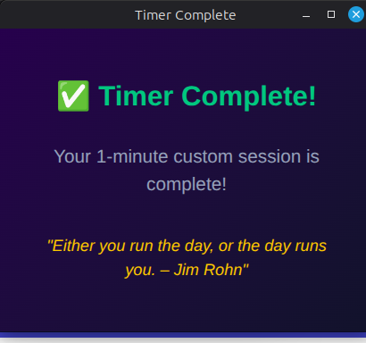

# 🛡️ TimeShield: The Ultimate Productivity Command Center

[](https://developer.chrome.com/docs/extensions/mv3/intro/)
[](https://www.apache.org/licenses/LICENSE-2.0)
[]()
[](http://makeapullrequest.com)
[](https://github.com/abishekgh-6/AdBlocker-FloatingClock-Extension)
[](https://github.com/abishekgh-6/AdBlocker-FloatingClock-Extension/releases)

**TimeShield** is a productivity extension for Chrome/Brave that combines high-performance ad blocking with a focused deep-work toolkit. It turns your browser into a dedicated workspace with a floating clock overlay, intelligent site blocking, and detailed usage analytics.

> 🔽 **Release builds**: Download the latest packaged extension (`TimeShield-*.zip`) from the GitHub **Releases** page and load it into Chrome/Brave via **Load unpacked**.

---

## ✨ Key Pillar Features

### 🕒 Floating Clock Overlay
*   **Always-Visible:** A sleek, draggable clock that stays on top of any website.
*   **Dynamic Resizing:** Pin it as a minimalist pill or expand it into a full productivity dashboard.
*   **Refined Design:** High-quality glassmorphism, blur effects, and subtle animations.
*   **Minimize Logic:** Collapse the clock into the title bar to save space while keeping it accessible.

### 🎯 Deep Focus Protocol
*   **Total Immersion:** Temporarily block distracting domains during high-intensity work sessions.
*   **Immediate Redirection:** Distracting sites are instantly swapped for a mindful "Focus in Progress" screen.
*   **Accurate Countdowns:** Real-time remaining time updates right on the block screen and the floating clock.
*   **Auto-Acknowledge Popups:** When your session ends, a beautiful summary popup appears and auto-closes after 5 seconds to keep your transition smooth.

### 🩹 Surgical Ad-Shielding
*   **Ad-Shield:** High-efficiency blocking of ads, trackers, and intrusive scripts using the Declarative Net Request API.
*   **Surgical Content Preservation:** Intelligent detection that blocks ads while strictly whitelisting user posts, captions, and comments.
*   **Element Picker:** Right-click and hide any annoying element on a page permanently.
*   **False-Positive Prevention:** Whitelists `role="article"` and content-heavy text blocks to ensure social media feeds remain intact.

### 📋 Task List
*   **Integrated Tasks:** Track your daily objectives directly in the extension popup.
*   **Focus-Linked:** Associate tasks with focus sessions to see what you completed during deep work.

### 📊 Screen Time & Usage Analytics
*   **Per-Site Breakdown:** See how much total time and how many opens each site gets.
*   **Day / Week / Month Ranges:** Toggle between Today, last 7 days, and last 30 days to understand your habits.
*   **24-Hour Bar Graphs:** Click any site to reveal a beautiful 24h bar graph (x-axis = hour, y-axis = time spent).
*   **Inline Detail:** Usage graphs expand directly under each site row for a clean dashboard feel.

### ⏱️ Schedules & Time Limits
*   **Scheduled Blocking:** Automatically block distracting sites during your chosen hours and days.
*   **Per-Site Daily Limits:** Cap time on specific sites (e.g., 30 minutes/day on YouTube).
*   **Global Distraction Pool:** Put multiple time-waster sites behind one shared time budget.
*   **Whitelist:** Keep important sites unblocked even when other rules are active.

---

## 🚀 Quick Start Guide

### Installation from Source
1.  **Clone** this repository to your local machine.
2.  Open Chrome and go to `chrome://extensions/`.
3.  Switch on **Developer Mode** (top-right toggle).
4.  Click **Load unpacked** and select the extension folder.
5.  **Pin** TimeShield to your toolbar for the best experience!

### Installation from GitHub Releases
1.  Go to the **Releases** tab of `abishekgh-6/FloatingClockExtension` on GitHub.
2.  Download the latest `TimeShield-*.zip` file.
3.  Extract the zip (optional, for inspection) or load it directly via **Load unpacked** pointing at the extracted folder.

### Using Focus Mode
1.  Open the TimeShield popup.
2.  Add websites you want to block in the **Settings**.
3.  Click **"Focus Mode"** and enter your desired duration.
4.  Start your focus session; distracting sites will be automatically blocked for the duration.

---

## 🛠️ Technical Stack & Architecture

TimeShield is built on a modern Chrome extension stack:

*   **Logic:** Modern asynchronous JavaScript with Service Worker (Manifest V3).
*   **Blocking Engine:** `declarativeNetRequest` for native-speed ad and site filtering.
*   **Storage:** `chrome.storage.local` for high-speed state persistence and consistency across reboots.
*   **UI/UX:** Vanilla CSS with a focus on Glassmorphism, CSS Variables for theming, and smooth transitions.

```text
FloatingClockExtension/
├── background/          # Persistent Background Service Worker
├── content/             # DOM-injected Blocker & UI Widgets
├── floating/            # The Floating Clock & Focus Screens
├── popup/               # The Primary Control Panel
├── options/             # Advanced Analytics & Personalization
└── rules/               # Static DNR Filtering Sets
```

---

## 🖼️ Screenshots
Below are reference screenshots for the main views in TimeShield.

### Options Dashboard

<details>
<summary><strong>General Settings</strong> – View image</summary>


_File: assets/screenshots/options-general.png_

</details>

<details>
<summary><strong>Clock Settings</strong> – View image</summary>


_File: assets/screenshots/options-clock.png_

</details>

<details>
<summary><strong>Focus Mode Settings</strong> – View image</summary>


_File: assets/screenshots/options-focus.png_

</details>

<details>
<summary><strong>Schedules & Time Limits</strong> – View image</summary>


_File: assets/screenshots/optins-schedules-limits.png_

</details>

<details>
<summary><strong>Ad Blocker Settings</strong> – View image</summary>


_File: assets/screenshots/options-adblock.png_

</details>

<details>
<summary><strong>Screen Time Overview</strong> – View image</summary>


_File: assets/screenshots/options-screentime.png_

</details>

<details>
<summary><strong>Tasks</strong> – View image</summary>


_File: assets/screenshots/options-tasks.png_

</details>

<details>
<summary><strong>Data Management</strong> – View image</summary>


_File: assets/screenshots/options-data.png_

</details>

---

### Popup & Floating Clock

<details>
<summary><strong>Control Center Popup</strong> – View image</summary>


_File: assets/screenshots/control-panel.png_

</details>

<details>
<summary><strong>Floating Clock Overlay</strong> – View image</summary>


_File: assets/screenshots/floating-clock.png_

</details>

---

### Focus & Limits Screens

<details>
<summary><strong>Focus Block Screen</strong> – View image</summary>


_File: assets/screenshots/focus-block.png_

</details>

<details>
<summary><strong>Time Limit Screen</strong> – View image</summary>


_File: assets/screenshots/limit-block.png_

</details>

<details>
<summary><strong>Timer / Focus Complete</strong> – View image</summary>



_File: assets/screenshots/timer-complete.png_

</details>

---

## 🎨 Themes

TimeShield includes multiple visual themes (Dark, Light, Aurora Gradient, Neon Focus, Solar Ember, Forest Deep Work) so you can match the clock and options UI to your style.

- Open the **Options** page and go to the **General / Appearance** section.
- Use the **Theme** dropdown to switch between themes.
- The floating clock, popup, and options page update instantly to reflect your chosen theme.

---

## 📈 Privacy First
TimeShield is private by design. **None of your browsing data, site usage, or task lists ever leave your computer.** All analytics are processed locally and stored within your Chrome profile's isolated storage.

---

## 🤝 Contributing
Contributions are what make the open source community such an amazing place to learn, inspire, and create. Any contributions you make are **greatly appreciated**.

1. Fork the Project
2. Create your Feature Branch (`git checkout -b feature/AmazingFeature`)
3. Commit your Changes (`git commit -m 'Add some AmazingFeature'`)
4. Push to the Branch (`git push origin feature/AmazingFeature`)
5. Open a Pull Request

---

## 📄 License
Distributed under the Apache License 2.0. See `LICENSE` for full terms.

---

**Designed and engineered for sustained, distraction-free deep work.**