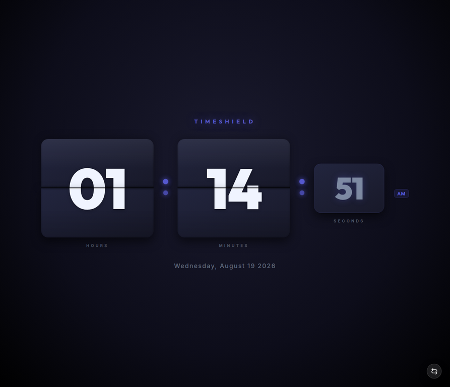

# TimeShield

[](https://github.com/abishek-ghimire/TimeShield/releases)
[](https://developer.chrome.com/docs/extensions/develop/migrate/what-is-mv3)
[](LICENSE)
[](https://github.com/abishek-ghimire/TimeShield/blob/main/data/repository-traffic.json)

> **A local-first productivity and focus extension for Chromium-based browsers.**

TimeShield brings everyday focus tools into one extension:

- Floating and flip clocks
- Focus and Nuclear Mode
- Scheduled and sleep protection
- Website usage limits
- Screen-time tracking
- Local tasks and timers
- Optional ad protection
- YouTube Focus Learning Mode

### Why TimeShield?

- **Local-first:** Core data stays in the browser.
- **No account required:** Core productivity features work without an account or cloud sync.
- **User-controlled:** Protection starts only when we explicitly enable it.
- **Built for focus:** Tools are designed to reduce distractions without unnecessarily restricting useful websites.

| Resource | Link |
| --- | --- |
| Source repository | [github.com/abishek-ghimire/TimeShield](https://github.com/abishek-ghimire/TimeShield) |
| Issues and feature requests | [Open an issue](https://github.com/abishek-ghimire/TimeShield/issues) |
| Releases | [View GitHub Releases](https://github.com/abishek-ghimire/TimeShield/releases) |
| Current manifest version | `2.3.4` |

> **Distribution note:** Latest development changes are maintained on `main` and can be loaded as an unpacked extension. New ZIP/release packages are not created for every change.

---

# Features at a glance

| Feature | What it does |
| --- | --- |
| **Floating Clock** | Draggable and resizable clock that can sync across supported tabs. |
| **Flip Clock** | Separate split-flap clock view in a browser tab. |
| **Timers** | Configurable timers with optional completion sounds and floating display. |
| **Focus Mode** | Blocks selected websites during an active focus session. |
| **Nuclear Mode** | Strict timed allowlist with session setup, protected tabs, pause/exit verification, and YouTube Focus Learning Mode. |
| **Scheduled Blocking** | Blocks selected websites during chosen days and times. |
| **Sleep Protection** | Separate website protection for sleep hours, including overnight schedules. |
| **Usage Limits** | Tracks selected websites and blocks them after daily limits. |
| **Screen Time** | Tracks active browsing time with daily, weekly, and monthly views. |
| **Tasks** | Simple local task list for everyday work. |
| **Ad Protection** | Optional local filtering, element selection, and custom rules. |
| **Themes** | Light, Dark, and Solar Ember themes. |
| **Local-first storage** | Keeps core settings and activity data in browser storage. |

---

# Screenshots

<details>
<summary>View the TimeShield screenshots</summary>

## Control Center


## General Settings


## Clock Settings


## Clock View


## Flip Clock



## Focus Mode


## Scheduled Blocking


## Ad Protection


## Tasks


## Screen Time


## Data Management


</details>

---

# Installation

TimeShield is a **Manifest V3** extension for Chromium-based browsers. It currently runs as an **unpacked extension**, so no build step is required.

We have two ways to install it:

- **Option 1 — Clone the repository:** Best for development and keeping the source up to date.
- **Option 2 — Download the ZIP:** Easiest for users who simply want to install and use TimeShield.

---

## Option 1 — Clone the repository

This method is recommended if we want to work with the source code or receive future changes through Git.

### 1. Clone the repository

```bash
git clone https://github.com/abishek-ghimire/TimeShield.git
cd TimeShield
```

### 2. Load TimeShield in the browser

1. Open the browser's extension-management page.
2. Enable **Developer mode**.
3. Click **Load unpacked**.
4. Select the cloned **TimeShield** folder containing `manifest.json`.
5. Pin TimeShield to the toolbar if desired.

### Extension-management pages

| Browser | Extension page |
| --- | --- |
| Chrome | `chrome://extensions` |
| Brave | `brave://extensions` |
| Edge | `edge://extensions` |
| Other Chromium browsers | Open the browser's Extensions page manually |

> **Important:** Select the TimeShield project folder containing `manifest.json`, not the ZIP file.

### Updating a cloned installation

When new changes are available:

```bash
cd TimeShield
git pull
```

Then:

1. Open the browser's Extensions page.
2. Find **TimeShield**.
3. Click **Reload**.
4. Test the updated version.

---

## Option 2 — Download the ZIP

This is the easiest method if we do not want to use Git.

### 1. Download TimeShield

Download the latest release from the [GitHub Releases page](https://github.com/abishek-ghimire/TimeShield/releases).

The current release is:

**[TimeShield-v2.3.4.zip](https://github.com/abishek-ghimire/TimeShield/releases/download/v2.3.4/TimeShield-v2.3.4.zip)**

### 2. Extract the ZIP

After downloading:

1. Extract the ZIP file.
2. Open the extracted **TimeShield** folder.
3. Make sure the folder contains `manifest.json`.

### 3. Load the extension

1. Open the browser's extension-management page.
2. Enable **Developer mode**.
3. Click **Load unpacked**.
4. Select the extracted **TimeShield** folder.
5. Pin TimeShield to the toolbar if desired.

> **Important:** Do not select the `.zip` file directly. The ZIP must be extracted first.

### Updating a ZIP installation

When a newer release is available:

1. Download the latest ZIP from the [GitHub Releases page](https://github.com/abishek-ghimire/TimeShield/releases).
2. Extract the new ZIP.
3. Open the browser's Extensions page.
4. Replace the old installation if necessary.
5. Click **Load unpacked** and select the new TimeShield folder.

---

# Core features

## Floating Clock and Flip Clock

- Open the Floating Clock from the control panel.
- Drag and resize the clock on supported pages.
- Sync clock position and size across supported tabs.
- Use 12-hour or 24-hour time formats.
- Switch between Clock View and Flip Clock.
- Use the clock on supported local documents and PDFs after enabling file URL access.
- Browser-internal pages remain unavailable to normal extension overlays.

## Timers and floating display

- Create configurable timers from the control panel.
- Show timer information independently of Clock View.
- Display timer or focus-session overlays on supported pages.
- Play a completion sound when enabled.

## Focus Mode

- Choose the websites we want to protect.
- Start Focus Mode explicitly from the extension.
- Add the current site directly from the control panel.
- Get a save-work warning before blocking starts.
- Pause a session when needed.
- Use limited challenge-free one-minute pauses before verification is required.

## Scheduled Blocking

- Select websites to block.
- Choose specific days.
- Set start and end times.
- Support schedules that cross midnight.
- Keep the feature inactive until it is enabled and configured.

## Sleep Protection

- Maintain a separate protection list from Scheduled Blocking.
- Set dedicated sleep hours.
- Support overnight schedules.
- Use the master sound setting for pre-activation warnings.

## Usage Limits

- Set daily limits for selected websites.
- Track remaining time for configured sites.
- Receive warnings as the limit approaches.
- Optional warning sounds normally occur at **2 minutes** and **1 minute**.
- Avoid repeated warnings for the same threshold during the same local day.
- After reaching a limit, available pauses are **1, 5, or 10 minutes**.
- Additional confirmation is required when extending access.

## Screen Time

- Track active browsing time by website.
- View **daily, weekly, and monthly** statistics.
- Periodically checkpoint tracking data to handle Manifest V3 service-worker suspension.
- Historical time cannot be reconstructed if it was never recorded.
- Local files and PDFs can be tracked after enabling **Allow access to file URLs**.

### Enable local-file access

1. Open the browser's Extensions page.
2. Open TimeShield's **Details** page.
3. Enable **Allow access to file URLs**.
4. Reload TimeShield and reopen the document if needed.

## Tasks

- Create small everyday work items.
- Keep tasks stored locally.
- Use tasks without a separate account or external service.

## Optional Ad Protection

- Enable or disable ad protection independently.
- Use local filtering rules.
- Pick page elements for filtering.
- Add custom filters.
- Manage supported rule lists.

## Themes and interface customization

- Choose **Light**, **Dark**, or **Solar Ember**.
- Use the compact control panel.
- Use expandable settings sections.
- Use responsive controls designed for the browser toolbar.
- **Solar Ember** is the default theme.

---

# Nuclear Mode

Nuclear Mode is TimeShield's strongest protection feature.

- It is **opt-in**.
- It runs for a chosen amount of time.
- Only deliberately allowed destinations remain accessible.
- Unlisted websites and links are blocked by default.
- Nuclear Mode never starts automatically.

> **Nuclear Mode rule:** Without an explicit exception, an unlisted website or link is blocked.

## Starting a session

Start Nuclear Mode from the **Nuclear Mode** button in the control panel.

### Setup flow

1. Choose **Hours** and **Minutes**.
2. Optionally enable **Exclude all open tabs**.
3. Use saved whitelist entries.
4. Add extra websites or exact links if needed.
5. Review the save-work warning.
6. Confirm activation.

- Every activation uses a fresh setup dialog.
- The session duration is always explicit.
- There is no hidden default duration.

## Allowlist and open-tab exclusion

The allowlist supports:

- Bare domains
- Exact HTTP/HTTPS links
- Exact `file://` URLs

With **Exclude all open tabs**:

- Existing tabs are preserved when Nuclear Mode starts.
- Preserved tabs can include websites, localhost pages, local files, PDFs, and exact links.
- Newly opened tabs remain blocked unless otherwise allowed.

### Saved Nuclear Mode whitelist

The default saved entries include:

- `chatgpt.com`
- `gemini.google.com`
- `notebooklm.google.com`
- `claude.ai`
- `deepseek.com`
- `grok.com`
- `web.whatsapp.com`

These entries are automatically included in new Nuclear sessions.

## Automatic exceptions

| Destination | Behavior |
| --- | --- |
| Local files | `file://` pages remain available when file access is enabled. |
| Localhost | `localhost`, `127.0.0.1`, `0.0.0.0`, and IPv6 loopback pages remain available. |
| PDF URLs | HTTP/HTTPS URLs identifying PDFs remain available. |
| Other unlisted websites and links | Blocked unless allowlisted or preserved through open-tab exclusion. |

## Pausing and ending Nuclear Mode

- One **1-minute pause** is available without a challenge per Nuclear session.
- Later one-minute pauses and longer pauses require verification.
- The active control-panel button shows the remaining time.
- Ending the session requires verification.

### End Nuclear Mode

1. Select **Pause Blocks**.
2. Select **End Nuclear Mode with verification**.
3. Continue to verification.
4. Type the displayed motivational sentences exactly in lowercase.
5. Submit the challenge.

- The challenge uses first-person **“i”** wording.
- Symbols, numbers, or incorrectly formatted text are rejected.
- Nuclear Mode also ends automatically when its selected duration expires.
- Blocking rules and temporary exceptions are cleaned up afterward.

### YouTube Focus Learning Mode

When `youtube.com` or a YouTube subdomain is allowlisted, Nuclear Mode automatically applies a strict Focus Learning layout. No YouTube settings panel or option buttons are shown on the page.

The layout keeps only the search bar, normal video playback, comments, video description, and recommended videos available. It automatically hides the homepage feed, video sidebar, live chat, playlists, Shorts, the Shorts entry in the left navigation, dynamically loaded Shorts shelves and video cards in search results, end-screen videowall and cards, miniplayer, Mix Radio playlists, merch, tickets, offers, video buttons, channel details, the top header and notification bell, Explore, Trending, More from YouTube, irrelevant search-result shelves, and Subscriptions. Subscription pages redirect to the YouTube home page. Autoplay and annotations are disabled. Direct `/shorts` navigation is redirected away, and Shorts filtering uses a throttled observer only for newly inserted content rather than repeatedly scanning the whole page. Floating-clock setup is deferred so normal YouTube video loading and playback are not held up by the extension.

All filters and styling are removed when Nuclear Mode ends or when YouTube is not allowlisted. The automatic learning layout does not affect normal YouTube use outside an active Nuclear session.

---

# Pause behavior

Pause behavior depends on the active protection feature.

| Protection context | Challenge-free allowance | Verified pause behavior |
| --- | --- | --- |
| Nuclear Mode | One 1-minute pause per session | Later 1-minute and longer pauses require verification. |
| Focus, Schedule, and Sleep | Two eligible 1-minute pauses per local day | Later one-minute and supported longer pauses require verification. |
| Usage Limits | Site-limit choices of 1, 5, or 10 minutes | Confirmation is required when extending access. |

- A preparation countdown appears before required verification.
- The motivational challenge must be entered exactly as displayed.

---

# Privacy and local storage

TimeShield follows a **local-first** design.

| Data | Storage behavior |
| --- | --- |
| Settings and themes | Stored in browser extension storage. |
| Website lists and protection state | Stored locally and used for enforcement. |
| Tasks | Stored locally. |
| Screen Time | Stored locally and periodically checkpointed. |
| Nuclear Mode session state | Stores active session, duration, allowlist, preserved tabs, and pause usage. |

### Privacy principles

- No account is required for core productivity features.
- No TimeShield cloud server is required.
- Core data stays in the browser profile.
- Clearing extension data or removing the extension can remove locally stored data.

---

# Permissions

TimeShield requests only the browser permissions needed for its features.

| Permission or access | Purpose |
| --- | --- |
| `storage` | Stores settings, tasks, protection lists, sessions, and Screen Time data. |
| `alarms` | Runs schedules, expiry checks, pause expiry, and tracking checkpoints. |
| `tabs` | Reads active tabs, captures exclusions, and syncs supported behavior. |
| `webNavigation` | Observes navigation for blocking and Screen Time tracking. |
| `scripting` | Injects supported overlays and clock interfaces. |
| Host permissions | Enables website protection and supported page overlays. |
| Declarative Net Request | Applies blocking and optional ad-protection rules. |
| File URL access | Enables supported local-file clock, tracking, and Nuclear behavior. |

> Browser-internal pages such as `chrome://settings`, `chrome://extensions`, `brave://extensions`, and the Chrome Web Store cannot receive normal extension content scripts.

---

# Troubleshooting

## A website is blocked unexpectedly

Check whether any of these are active:

- Focus Mode
- Scheduled Blocking
- Sleep Protection
- Usage Limit
- Global Limit
- Nuclear Mode

If none should be active:

1. Reload TimeShield from the browser's Extensions page.
2. Close old block tabs.
3. Reopen the website in a new tab.

For Nuclear Mode:

- Add the destination to the session.
- Preserve its tab using **Exclude all open tabs**.
- Or wait for the session to expire.

## Nuclear Mode shows a DNR rule error

1. Reload TimeShield from the browser's Extensions page.
2. Close old TimeShield block tabs.
3. Reload the extension again if needed.
4. Start a new Nuclear session.

## The Nuclear exit button does not stop the session immediately

This is intentional.

1. Select **Pause Blocks**.
2. Select **End Nuclear Mode with verification**.
3. Complete the displayed lowercase challenge.

## The first Nuclear one-minute pause does not show a challenge

This is intentional.

- Nuclear Mode provides exactly one challenge-free 1-minute pause per session.
- Later one-minute pauses require verification.

## Screen Time is empty

1. Open a supported website.
2. Keep it active for at least **30–60 seconds**.
3. Open Screen Time.
4. Refresh the data.
5. Confirm TimeShield is enabled.
6. Confirm the page is not browser-internal.
7. For local documents, enable **Allow access to file URLs**.

## The pause challenge does not appear

1. Wait for the preparation countdown.
2. If it remains stuck, reload TimeShield.
3. Close the old blocked page.
4. Open a new blocked tab.
5. Request the pause again.

## The popup looks outdated after an update

1. Reload the extension.
2. Close old popup/block pages.
3. Open the control panel again.

---

# Project structure

```text
TimeShield/
├── background/      Manifest V3 service worker and protection enforcement
├── content/         Page-level scripts and floating interfaces
├── floating/        Clock, timer, block pages, and pause challenges
├── options/         Settings and Screen Time dashboard
├── popup/           Browser toolbar control panel
├── rules/           Local declarative network rules
├── assets/          Icons, screenshots, sounds, and static assets
├── tests/           Smoke and regression tests
├── manifest.json    Extension manifest
└── README.md       Project documentation
```

---

# Development

TimeShield does not require a framework build pipeline.

### Basic workflow

1. Clone the repository.
2. Load it with **Load unpacked**.
3. Make changes.
4. Reload the extension.
5. Run the test suite.

### Run tests

```bash
node --test tests/smoke.test.mjs
```

### Before submitting changes

- Confirm the extension loads without manifest errors.
- Check the popup and options page.
- Test Clock View and Flip Clock.
- Confirm protection remains opt-in.
- Check Screen Time tracking.
- Test local-file behavior when applicable.
- Run the test suite.

## Test command reference

| Check | Command |
| --- | --- |
| Smoke and regression suite | `node --test tests/smoke.test.mjs` |
| Service worker syntax | `node --check background/service-worker.js` |
| Popup syntax | `node --check popup/popup.js` |
| Block-page syntax | `node --check floating/nuclear-block.js` |
| Pause challenge syntax | `node --check floating/pause-challenge.js` |
| Whitespace errors | `git diff --check` |

The current suite contains **57 passing tests** covering protection modes, Nuclear Mode, Screen Time, notifications, popup behavior, settings persistence, and documentation checks.

---

# Contributing

Bug reports, feature ideas, documentation improvements, and code contributions are welcome through the [GitHub issue tracker](https://github.com/abishek-ghimire/TimeShield/issues).

---

# License

TimeShield is licensed under the [Apache License 2.0](LICENSE).

---

# References

[1]: https://developer.chrome.com/docs/extensions/develop/migrate/what-is-mv3 "Chrome Extensions: Manifest V3"
[2]: https://developer.chrome.com/docs/extensions/develop/concepts/declare-permissions "Chrome Extensions: Declare permissions"
[3]: https://developer.chrome.com/docs/extensions/reference/api/declarativeNetRequest "Chrome Extensions: Declarative Net Request API"
[4]: https://developer.chrome.com/docs/extensions/develop/concepts/content-scripts "Chrome Extensions: Content scripts"
[5]: https://docs.github.com/en/repositories/creating-and-managing-repositories/viewing-activity-and-data-for-your-repository "GitHub Docs: Viewing repository activity and data"
